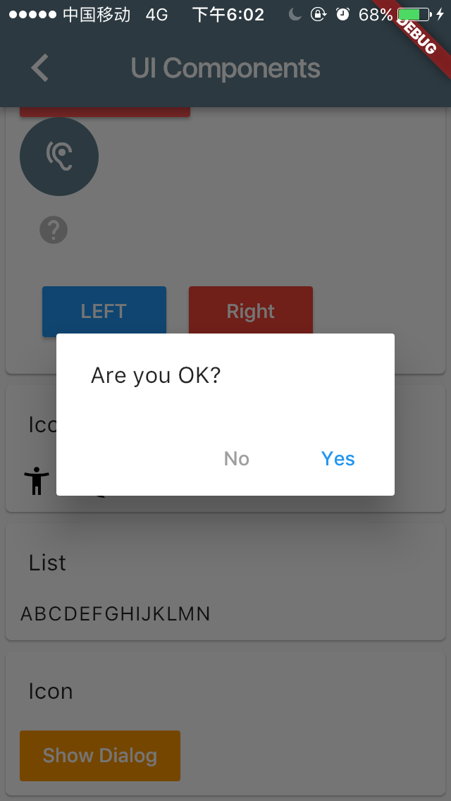
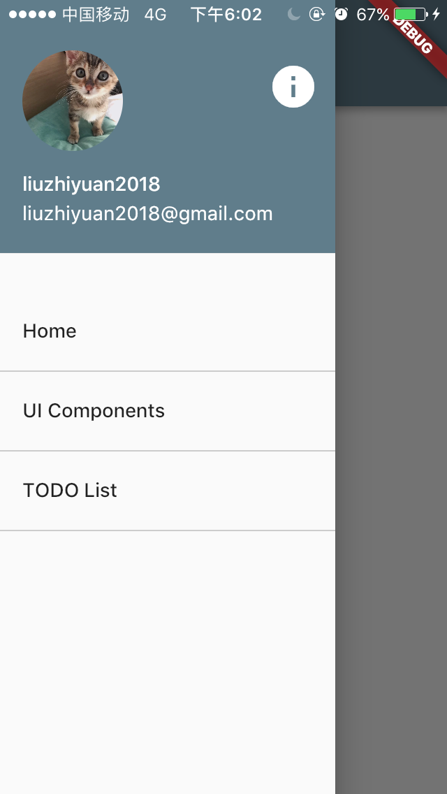

学习 Flutter 时写的 Demo 项目.
 
## 如何使用
```bash
git clone https://github.com/liuzhiyuan1993/hello_flutter
cd hello_flutter

# 1. 需要已安装 Flutter
# 2. 需要安装手机模拟器, 例如 Mac 下的 Simulator
flutter run
```

## wiki
+ [Dart 基本语法](https://github.com/liuzhiyuan1993/hello_flutter/wiki/Dart-%E5%9F%BA%E6%9C%AC%E8%AF%AD%E6%B3%95)
+ [使用 Simulator](https://github.com/liuzhiyuan1993/hello_flutter/wiki/%E4%BD%BF%E7%94%A8-Simulator)
+ [IDE 配置](https://github.com/liuzhiyuan1993/hello_flutter/wiki/IDE-%E9%85%8D%E7%BD%AE)
+ [使用 Flutter 过程中遇到的问题](https://github.com/liuzhiyuan1993/hello_flutter/wiki/%E4%BD%BF%E7%94%A8-Flutter-%E8%BF%87%E7%A8%8B%E4%B8%AD%E9%81%87%E5%88%B0%E7%9A%84%E9%97%AE%E9%A2%98)

## 预览
### TODO


### Demos


